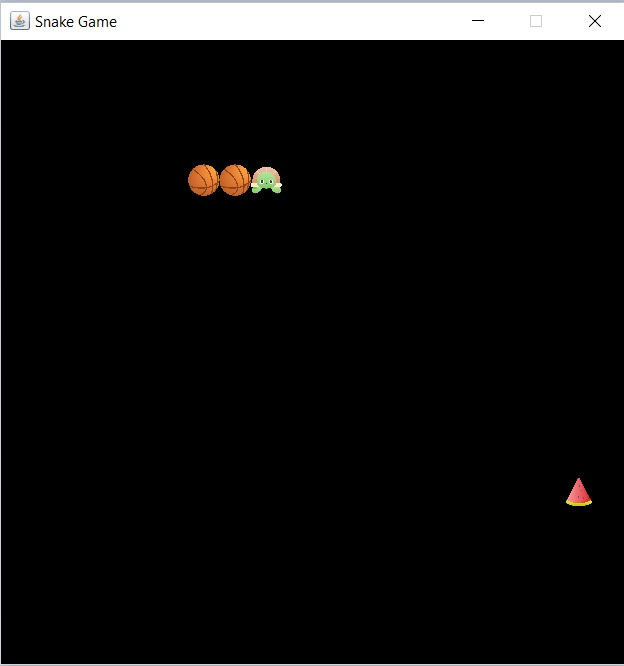

# 🐍 Snake Game

A classic Snake Game developed using **Java Swing**. The game provides a simple graphical interface where the player controls a snake, collects food, and tries to achieve the highest possible score without colliding with the walls or itself.

## 📌 Project Overview

This project was developed to practice Java programming concepts, GUI development, event handling, keyboard controls, and game logic using Java Swing.

## 🛠️ Technologies Used

* **Java**
* **Java Swing**
* **AWT**
* **Eclipse IDE**

## 🎮 Features

* Snake movement using keyboard arrow keys
* Food generation
* Score tracking
* Snake growth after eating food
* Collision detection
* Game-over functionality
* Graphical user interface using Java Swing
* Custom images for the snake and food

## 📂 Project Structure

```text
Snake-Game/
│
├── src/
│   └── sankeGame/
│       ├── Board.java
│       └── Other Java source files
│
├── images/
│   ├── Snake head image
│   ├── Snake body image
│   └── Food image
│
└── README.md
```

## ▶️ How to Run

1. Clone or download this repository.
2. Open the project in **Eclipse IDE**.
3. Make sure the image files are available in the project's `images` folder.
4. Open the main Java class.
5. Run the application as a **Java Application**.
6. Use the keyboard arrow keys to control the snake.

## 🎯 Game Objective

Control the snake, eat the food, and increase your score.

The game ends when the snake:

* Hits the game boundary.
* Collides with its own body.


## 📸 Screenshots

### Welcome Page


### Game Screen



### Game Over Screen


## 📚 Learning Outcomes

Through this project, I practiced:

* Java programming
* Object-oriented programming concepts
* Java Swing GUI development
* Event handling
* Keyboard input
* Timers and game loops
* Collision detection
* Working with images in Java
* Project organization in Eclipse

## 👩‍💻 Author

**Kshama Dhoke**

GitHub: [Kshama-Dhoke](https://github.com/Kshama-Dhoke)
